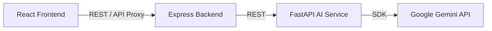

# ⚖️ AI Legal Document Analyzer

> An intelligent, production-ready full-stack application that analyzes legal documents using AI to extract key clauses, summarize content, and flag risks.

---

## 🏗️ Project Overview

The AI Legal Document Analyzer is a robust platform that automates the initial review of legal contracts, NDAs, and agreements. Users can upload a document and instantly receive a high-level summary, an analysis of potential legal risks, a breakdown of critical clauses, and a dedicated chat assistant to answer specific questions about the document's contents.

## ✨ Features

- **Document Parsing:** Upload PDF, DOCX, TXT, or Image files.
- **AI Summarization:** Plain-English summaries of complex legal jargon.
- **Risk Flagging:** Automatic highlighting of potentially unfavorable or unusual terms.
- **Clause Intelligence:** Deep breakdown of standard and missing clauses.
- **Interactive Chat:** Ask specific questions about your document in real-time.
- **Dark Mode Support:** Toggleable dark/light themes.

---

## 🏛️ Architecture



1. **React Frontend (Vite):** Manages user state, UI rendering, and interacts with the API layer.
2. **Express Backend (Node.js):** Acts as the API Gateway. Handles file uploads via Multer, proxies AI requests, and adds backend telemetry.
3. **FastAPI AI Service (Python):** Handles the core intelligence. Extracts text natively or via OCR, structures prompts, and interfaces with the Google Gemini API.
4. **Google Gemini API:** The underlying LLM powering the summaries, risk analysis, and chat.

---

## 📁 Folder Structure

```
legal-ai/
├── frontend/                    # React + Vite UI (Port 5173)
│   ├── src/
│   │   ├── components/          # Reusable UI (DropZone, ProgressBar)
│   │   ├── pages/               # Views (Dashboard, Upload, Summary, etc.)
│   │   ├── contexts/            # DocumentContext, ThemeContext
│   │   ├── hooks/               # useFileUpload
│   │   ├── services/            # API clients (api.js, geminiService.js)
│   │   └── utils/               # Helpers (fileHelpers.js)
│   ├── tests/                   # Vitest suites
│   └── .env.example             # Frontend environment variables
│
├── backend/                     # Node.js + Express API (Port 3001)
│   ├── src/
│   │   ├── controllers/         # Request handlers
│   │   ├── middleware/          # Multer upload, Error handlers
│   │   ├── routes/              # Express routers
│   │   ├── app.js               # Express application factory
│   │   └── server.js            # Server entry point
│   ├── tests/                   # Jest API test suites
│   ├── uploads/                 # Temporary file storage
│   └── .env.example             # Backend environment variables
│
├── ai-service/                  # Python + FastAPI (Port 8000)
│   ├── app/
│   │   ├── routers/             # FastAPI route definitions
│   │   ├── services/            # Gemini logic, OCR, Extraction
│   │   ├── models/              # Pydantic schemas
│   │   └── utils/               # Prompts and helpers
│   ├── tests/                   # Pytest test suites
│   ├── main.py                  # FastAPI entry point
│   └── .env.example             # AI service environment variables
│
└── docs/                        # Architecture and API documentation
```

---

## 🛠️ Technology Stack

| Layer | Technologies | Purpose |
|-------|-------------|---------|
| **Frontend** | React 19, Vite, CSS Modules | UI, Global State, Routing |
| **Backend** | Node.js, Express, Multer | API Gateway, File Processing |
| **AI Service** | Python 3.11+, FastAPI, Pydantic | AI Logic, Text/OCR Extraction |
| **Testing** | Vitest, RTL, Jest, Pytest | Quality Assurance |

---

## 🚀 Installation & Setup

### Prerequisites
- Node.js v20+
- Python 3.11+
- npm 9+
- A Google Gemini API Key

### 1. Environment Variables

Copy the example environment files and configure them:

```bash
cp frontend/.env.example frontend/.env
cp backend/.env.example backend/.env
cp ai-service/.env.example ai-service/.env
```

Ensure you add your `GEMINI_API_KEY` to `ai-service/.env`.

### 2. Running the AI Service (FastAPI)

```bash
cd ai-service
python3 -m venv .venv
source .venv/bin/activate
pip install -r requirements.txt
uvicorn main:app --reload --port 8000
```

### 3. Running the Backend (Express)

```bash
cd backend
npm install
npm run dev
```

### 4. Running the Frontend (React/Vite)

```bash
cd frontend
npm install
npm run dev
```

The application will be available at [http://localhost:5173](http://localhost:5173).

---

## 🧪 Testing

The project contains test suites for all three layers.

**Frontend (Vitest & RTL):**
```bash
cd frontend
npm test
```

**Backend (Jest & Supertest):**
```bash
cd backend
npm test
```

**AI Service (Pytest):**
```bash
cd ai-service
source .venv/bin/activate
pytest tests/
```

---

## 🌐 Deployment

The application is fully production-hardened and configurable via environment variables.

1. **Frontend:** Build with `npm run build` and deploy the `dist/` folder to Vercel, Netlify, or AWS S3. Ensure `VITE_AI_SERVICE_URL` is set to your deployed AI service.
2. **Backend:** Deploy as a Node.js container or App Service (e.g., Heroku, Render). Set `FRONTEND_URL` and `AI_SERVICE_URL`.
3. **AI Service:** Deploy as a Python container (e.g., Google Cloud Run, Railway). Set `ALLOWED_ORIGINS` to accept traffic from your frontend and backend domains.

---

## 🔮 Future Improvements
- **Authentication:** Add user sign-in (Firebase/Auth0) to store document history.
- **Database:** Connect PostgreSQL or MongoDB to persist parsed results.
- **More AI Models:** Abstract Gemini to support OpenAI/Anthropic fallback.

---

## 📄 License
ISC License
