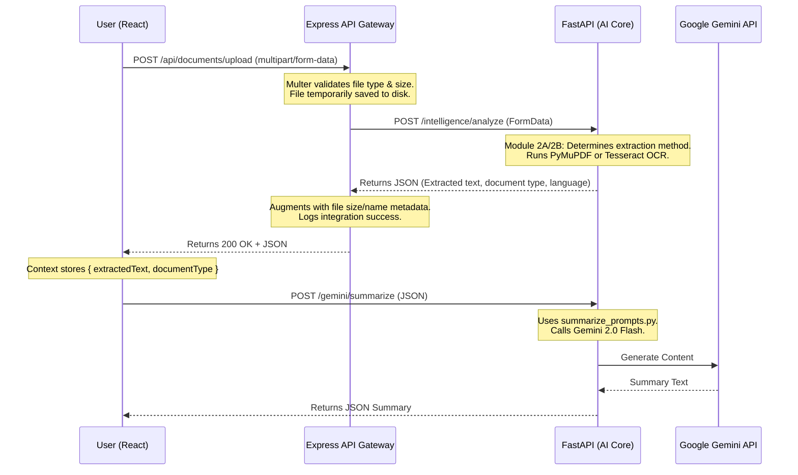

# Architecture Overview

The Legal AI Platform is designed as a decoupled, three-tier architecture ensuring scalability, separation of concerns, and security.

## System Flow

## Layers

### 1. React Frontend (Vite)
- **Role:** Presentation and global state management.
- **State Machine:** Uses `useFileUpload.js` hook combined with `DocumentContext` (useReducer) to maintain strict state transitions (IDLE → SELECTED → UPLOADING → SUCCESS/ERROR).
- **Communication:** Avoids CORS issues in development by proxying `/api` requests through Vite's dev server to Express. Direct communication with FastAPI is allowed via CORS.

### 2. Node.js Express Backend
- **Role:** Security, file handling, and API Gateway.
- **Middleware:** Uses `multer` for safe multipart form parsing (5MB limit, strict MIME checking).
- **Resilience:** Express controller catches downstream network errors from FastAPI (`ECONNREFUSED`, `ECONNABORTED`) and translates them into user-friendly HTTP 503/504 responses.

### 3. FastAPI AI Service
- **Role:** Heavy lifting, text extraction, and LLM communication.
- **Extraction:** Dynamically routes PDFs/DOCX to PyMuPDF/python-docx (Module 2A) and Images/Scanned PDFs to Tesseract OCR (Module 2B).
- **AI Integration:** Uses `google-genai` SDK. Wraps all Gemini calls in an exponential backoff retry mechanism (Module 3.1) to gracefully handle HTTP 429 Rate Limits from Google.
